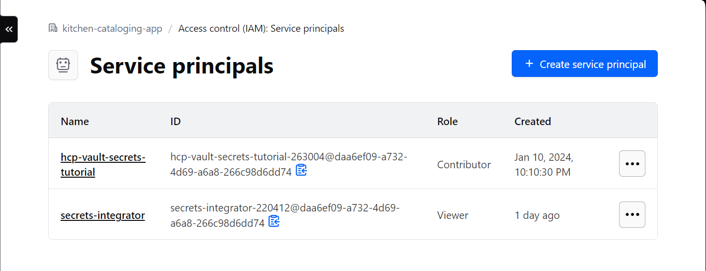

# Hashicorp Vault Secrets Github Action

## Introduction

Currently, [Hashicorp Vault Secrets](https://developer.hashicorp.com/hcp/docs/vault-secrets) has a direct one-click intergation that links a Github Repo to an app of their choosing.

However, as highlighted by their [documentation](https://developer.hashicorp.com/hcp/docs/vault-secrets/integrations/github-actions), there are severe limitations. For example:

1. You can only sync secrets from a single Hashicorp Cloud Platform project
2. You can only sync a single organization with a repository.
3. This integration requires the Hashicorp Vault Secrets App to be installed and configured in your repository
   - This is not possible if the repository lives in an organization and the user is not a Github organization owner/admin.

This action provides a solution for the aforementioned problems, by using a service principal on your HashiCorp Cloud Platform account, to programmatically access Hashicorp Vault secrets in a Github action runner, and pass them into your workflows.

## Configuring a Service Principal

### Requirements:

- You must be using a HCP Vault Secrets App
- You must be a HashiCorp Cloud Platform organization Admin or Owner

### Steps:

1. Go [here](https://portal.cloud.hashicorp.com/sign-in) and login
2. Go to your organization
3. Go to **Access Control IAM**. Go to **Service Principals** and create a service principal account

##### Service Princpal Page Example



## Action Usage

### Quickstart

```yaml
name: Hashicorp Vault Secrets
uses: aasmal97/HashicorpVaultSecrets@v2.0.0
with:
  CLIENT_ID: ${{ secrets.HASHICORP_CLIENT_ID }}
  CLIENT_SECRET: ${{ secrets.HASHICORP_CLIENT_SECRET }}
  ORGANIZATION_ID: "4234382942355-e0wrfwefwe"
  PROJECT_ID: "wqeqwewq3920rfew-f43gghg3fe"
  APP_NAME: "ci-cd-pipeline-app"
  SECRET_NAMES: '["EXAMPLE_ID"]'
```

### Inputs:

- ##### CLIENT_ID: `string` (required)
  - This is the Organization Service Principal's generated CLIENT_ID acquired from your Hashicorp Portal.
- ##### CLIENT_SECRET: `string` (required)
  - This is the Organization Service Principal's generated CLIENT_SECRET acquired from your Hashicorp Portal.
- ##### ORGANIZATION_ID: `string` (required)
  - This is the Organization ID that the Service Principal was created on. To access this, go to your organization settings
- ##### PROJECT_ID: `string` (required)
  - This is the project ID that holds the apps where the secrets are stored. To access this, go to your project's settings
- ##### APP_NAME: `string` (required)

  - This is the app name, that holds the secrets

- ##### SECRET_NAMES: `string` (optional)

  - This is **JSON Stringified List** of the secret names you want to extract.
  - To ensure your list of variables have the correct syntax, pass your array/list through a JSON.stringifier and pass the resulting string in here.
  - Note: We use `JSON.parse` to parse this string into a list since GitHub Actions does not currently support a list input

- ##### GENERATE_ENV: `string` (optional)

  - The name of the `.env` file that you wish to generate. If your name contains a _`.`_, your provided name will become the file name of the `.env` file. If not, it will become the `{name} + .env`

    For example:

    - `mysecrets.env.local` as the `GENERATE_ENV` value, becomes `mysecrets.env.local`.
    - `mysecrets` as the `GENERATE_ENV` value, becomes `mysecrets.env`

- ##### ALL_SECRETS: `boolean` (optional)
  - If you want to grab all the secrets on the hashicorp vault secrets app, set this to `true`. By default, this is `false`. If this is set, you do not need to set `SECRET_NAMES`

### Using Action Output

#### In a Github Action job

To use this action's output in subsequent workflow steps, ensure your `id` from the running action step, is the key to the subsquent step.

##### Example:

```yaml
steps:
  - name: Hashicorp Vault Secrets
    id: hashicorp-vault-secrets
    uses: aasmal97/HashicorpVaultSecrets@v2.0.0
    with:
      CLIENT_ID: ${{ secrets.HASHICORP_CLIENT_ID }}
      CLIENT_SECRET: ${{ secrets.HASHICORP_CLIENT_SECRET }}
      ORGANIZATION_ID: "4234382942355-e0wrfwefwe"
      PROJECT_ID: "wqeqwewq3920rfew-f43gghg3fe"
      APP_NAME: "ci-cd-pipeline-app"
      SECRET_NAMES: '["EXAMPLE_ID"]'

  - name: Example Step
    run: echo "The output value is ${{ steps.hashicorp-vault-secrets.outputs.EXAMPLE_ID }}"
```

#### Using a generated .env file

To use this, you must use the `GENERATE_ENV` input.

```yaml
steps:
  - name: Hashicorp Vault Secrets
    uses: aasmal97/HashicorpVaultSecrets@v2.0.0
    with:
      CLIENT_ID: ${{ secrets.HASHICORP_CLIENT_ID }}
      CLIENT_SECRET: ${{ secrets.HASHICORP_CLIENT_SECRET }}
      ORGANIZATION_ID: "4234382942355-e0wrfwefwe"
      PROJECT_ID: "wqeqwewq3920rfew-f43gghg3fe"
      APP_NAME: "ci-cd-pipeline-app"
      SECRET_NAMES: '["EXAMPLE_ID"]'
      GENERATE_ENV: "example.env"

  - name: Check if example.env exists
    shell: bash
    run: |
      if test -f /example.env; then
         echo "File exists."
      fi
```

#### Load all secrets in Vault Secrets App

```yaml
steps:
  - name: Hashicorp Vault Secrets
    id: hashicorp-vault-secrets
    uses: aasmal97/HashicorpVaultSecrets@v2.0.0
    with:
      CLIENT_ID: ${{ secrets.HASHICORP_CLIENT_ID }}
      CLIENT_SECRET: ${{ secrets.HASHICORP_CLIENT_SECRET }}
      ORGANIZATION_ID: "4234382942355-e0wrfwefwe"
      PROJECT_ID: "wqeqwewq3920rfew-f43gghg3fe"
      APP_NAME: "ci-cd-pipeline-app"
      ALL_SECRETS: true

  - name: Example Step
    run: echo "The output value is ${{ steps.hashicorp-vault-secrets.outputs.EXAMPLE_ID }}"
```

## Limitations

- The service principal account must be configured at the **Organization Level**. This limitation is imposed by Hashicorp themselves, and until this changes, there can't be support for more granular access (i.e service principal for only a project).
- The `SECRET_NAMES` must be a string since list inputs are not supported by Github Actions. In the future, this may be changed, when Github supports list inputs natively.
- This action can only run in **ubuntu** environments. It is not supported in darwin or mac. This is due primarily to ubuntu being the most common environment for Github action runners, but it is also due to my lack of hardware and time. However, in the future, support can be added if it is seen as a good or necessary feature.

## Contributing

Anyone is welcome to contribute, simply open an issue or pull request. When opening an issue, ensure you can reproduce the issue, and list the steps you took to reproduce it.

### Development Environment

To run the development environment, ensure the following are configured properly, and your are running the appropiate commands.

#### Requirements

- [Docker](https://docs.docker.com/engine/install/) installed on your machine. It will provide the virtual environment needed to run a Github Action
- [nektos/act](https://github.com/nektos/act) installed. This is the software that uses Docker to create a container, that resembles a Github Action Environment for testing
- Have a package manager installed (i.e, npm, yarn, etc)
- Create a Hashicorp Cloud Platform Account
  1. Go [here](https://portal.cloud.hashicorp.com/sign-in) and create an account
  2. Create a dummy organization
  3. Go to **Access Control IAM**, then go to **Service Principals** and create a dummy service principal account
     - **Save** the **_Client ID_** and **_Client Secret_** values in a `my.secrets` file in the following path `test/workflows/my.secrets`. `nektos/act` will use this to run the virtual github action.
     - Note: The `my.secrets` file follows the same form/syntax as a regular `.env` file.
  4. Create a dummy project in your organization
  5. Click on newly created dummy project, and go to **Vault Secrets**
  6. Go to **Applications** and create a dummy application
  7. Fill in the dummy application with dummy secrets

#### Running Dev Environment

1. Run `npm i`
2. Run `npm run dev`
